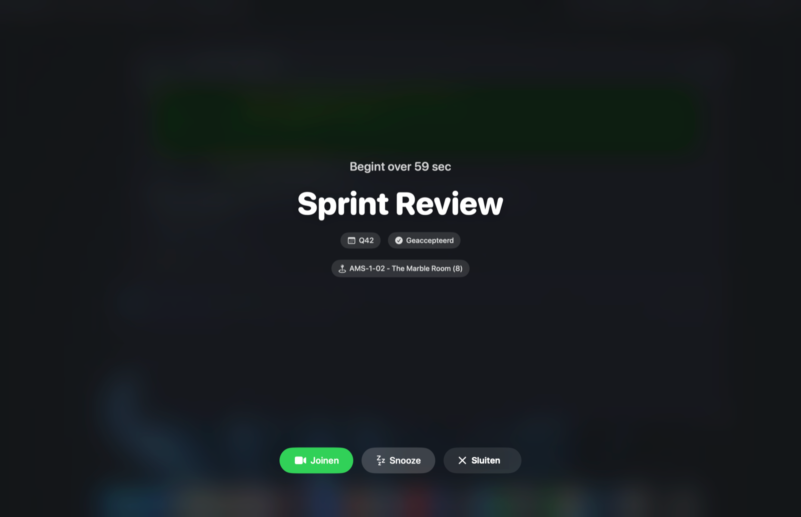

# Bonk — never miss a meeting again

**Bonk is a free, privacy-friendly macOS menu bar app that makes sure you never miss
a meeting.** Right before every calendar event it shows a **full-screen alert** you
can't miss (or a subtle pill at the top of your screen), with a live countdown and a
**one-click Join button** for Google Meet, Zoom, Microsoft Teams and Webex.

**[⬇️ Download for macOS](https://github.com/Kierkels/bonk/releases/latest)** ·
**[Website](https://bonk.kierkels.app)** (Dutch/English) · Requires macOS 14+



## Why Bonk?

macOS calendar notifications are small corner banners that vanish before you notice
them. Bonk turns them into alerts you actually see — as bold or as subtle as you
want, per meeting:

- 🖥️ **Full-screen alert** over everything (even full-screen apps, on every monitor),
  precisely on the second
- 🔔 **Or a subtle pill** on the screen you're working on, with countdown, Join and Snooze
- 🎥 **One-click join** — detects Meet/Zoom/Teams/Webex links automatically; optional
  auto-join at start time
- 🎛️ **Smart rules** — filter by title, calendar, weekday or RSVP status; choose the
  alert style and lead time per rule; auto-ignore lunch or "[hold]" blocks
- ⏰ **Custom reminders** outside your calendar ("in 15 minutes" or at a set time,
  optionally repeating), with a global quick-add hotkey
- 📊 **Menu bar countdown** to your next meeting, in your calendar's colour
- 🔊 **Alarm sounds** that can repeat until you respond — even when your Mac is muted
  or locked
- 📅 Works with **Google Calendar, iCloud, Outlook/Exchange** — anything your Mac
  already syncs (EventKit)
- 🌍 Dutch & English, light & dark mode
- 🔒 **Privacy by design**: your calendar is read locally, nothing goes to a server,
  no account, no tracking
- 🆓 **Completely free** — no ads, no subscription, no "pro" tier

---

*Nederlands: Bonk is een gratis macOS-menubalk-app die je vlak vóór elke meeting
waarschuwt — schermvullend en "in your face", of via een subtiele pill — met één
klik joinen, snoozen of negeren. Zie **[bonk.kierkels.app](https://bonk.kierkels.app)**.*

---

## Repository layout

| Folder | Contents |
|---|---|
| [`app/`](app/) | The Swift app (SwiftPM package, `build.sh`, icon, sources). See [`app/README.md`](app/README.md). |
| [`website/`](website/) | The static marketing site (`index.html`, `styles.css`, `assets/`). |

## Quick start (development)

```bash
# Build the app, install into /Applications and launch:
./app/build.sh

# Preview the website locally:
open website/index.html
```

## Website deploy

The site is published automatically to **Cloudflare Pages** (live at
**https://bonk.kierkels.app**) by the GitHub Action
[`.github/workflows/deploy-website.yml`](.github/workflows/deploy-website.yml) on
every push to `main` that touches `website/**` (or manually via *Run workflow*).

One-time setup: add the repo secrets `CLOUDFLARE_API_TOKEN` and
`CLOUDFLARE_ACCOUNT_ID`, then attach `bonk.kierkels.app` as a custom domain to the
Pages project `bonk`. Details are at the top of the workflow file.

## App release

On every push to `main` that touches `app/**`,
[`.github/workflows/release-app.yml`](.github/workflows/release-app.yml) builds
`Bonk.app`, wraps it in a `.dmg` and publishes a GitHub Release with the version
from the app (`CFBundleShortVersionString`, set in [`app/build.sh`](app/build.sh)).
Bump that version to create a new release tag (`vX.Y`).

## License

MIT — see [LICENSE](LICENSE).

© 2026 Roland Kierkels
